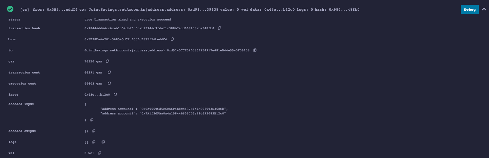
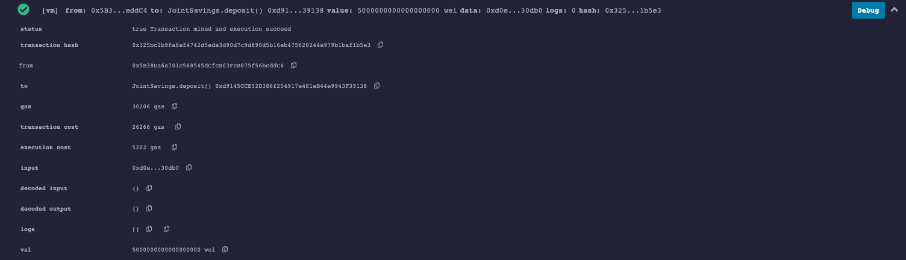
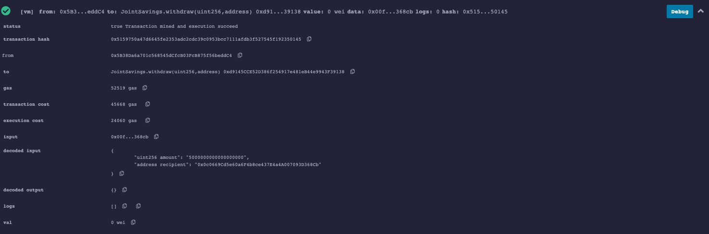

# Module 20 Challenge

20th Challenge for Columbia Fintech Bootcamp

## Technologies

* Solidity
* Remix IDE

## Summary

Initially, I modified a given file to establish a shared savings account on the Ethereum blockchain, where either of two users can put in or take out money from the account. Later, I assembled and launched the smart contract in the Remix IDE, and carried out certain actions with the deployed smart contract.

### Set Accounts

### Deposit Funds

### Withdraw Funds

